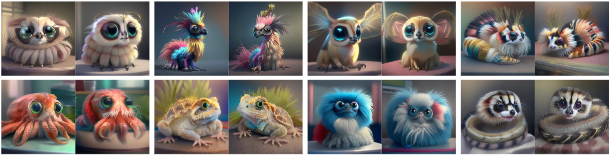
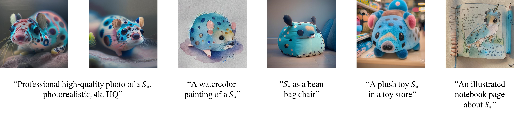
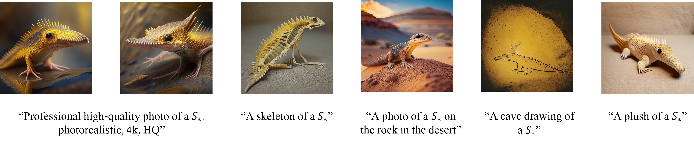
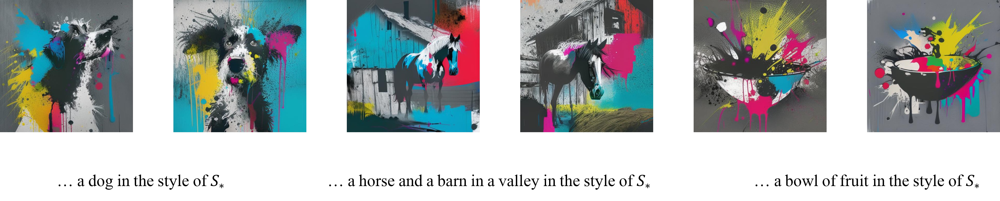
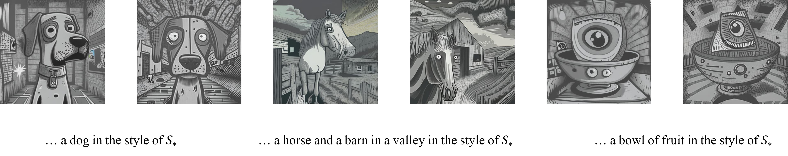
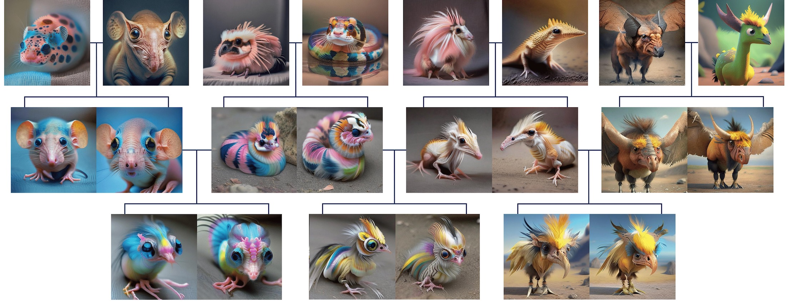
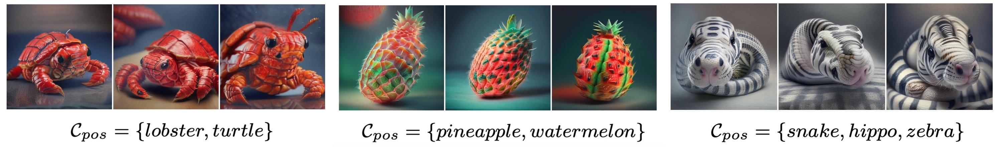

# ConceptLab: Creative Concept Generation using VLM-Guided Diffusion Prior Constraints
> Elad Richardson, Kfir Goldberg, Yuval Alaluf, Daniel Cohen-Or  
> Tel Aviv University  
> Recent text-to-image generative models have enabled us to transform our words into vibrant, captivating imagery. The surge of personalization techniques that has followed has also allowed us to imagine unique concepts in new scenes. However, an intriguing question remains: How can we generate a <i>new</i>, imaginary concept that has never been seen before? In this paper, we present the task of <i>creative text-to-image generation</i>, where we seek to generate new members of a broad category  (e.g., generating a pet that differs from all existing pets). We leverage the under-studied Diffusion Prior models and show that the creative generation problem can be formulated as an optimization process over the output space of the diffusion prior, resulting in a set of "prior constraints". To keep our generated concept from converging into existing members, we incorporate a question-answering Vision-Language Model (VLM) that adaptively adds new constraints to the optimization problem, encouraging the model to discover increasingly more unique creations. Finally, we show that our prior constraints can also serve as a strong mixing mechanism allowing us to create hybrids between generated concepts, introducing even more flexibility into the creative process.

<a href="https://arxiv.org/abs/2308.02669"></a>
<a href="https://kfirgoldberg.github.io/ConceptLab/"></a> 

<p align="center">
  
<br>
New pets generated using ConceptLab. Each pair depicts a learned concept that was optimized to be novel and not match existing members of the pet category. Running our method with different seeds allows us to generate a variety of different brand-new concepts.
</p>

## Description
Official implementation of our ConceptLab paper.

## Setup
To create the conda environment needed to run the code, run the following command:

```
conda env create -f environment/env.yaml
conda activate ConceptLab
```

Alternatively, install the requirements from `requirements.txt`

## Usage
### Creative Generation
<p align="center">
  
  
  
  
<br>
Sample text-guided creative generation results and edits obtained with ConceptLab.
</p>

#### Training a New Concept

To train a new concept of the `pet` category using the Adaptive Negatives scheme, run the following command:

```python -m scripts.train --config configs/new_pet.yaml --output_dir=<output_dir>```

#### Generating Images with a Trained Concept
To generate images from a trained concept, using some prompts e.g. `['a photo of a {}','a plush toy {}']` run the following command:

```python -m scripts.infer --prompts="['a photo of a {}','a plush toy {}']" --output_dir <output_dir> --learned_embeds_path <learned_embeds_path.bin>```

#### Creating Art Styles
To create an art style instead of an object use the following command
```python -m scripts.train --config configs/new_art.yaml --output_dir=<output_dir>```


### Evolutionary Generation
<p align="center">
  
<br>
ConceptLab can be used to mix up generated concepts to iteratively learn new unique creations. This process can be repeated to create further "Generations", each one being a hybrid between the previous two.
</p>

#### Creating Parents Gallery
In order to define each parent in the evolution process, we first need to create a few (3-5) images of each.
To do so, the following command can be used

```python -m scripts.infer --prompts="['a photo of a {}']" --output_dir <output_dir> --learned_embeds_path <learned_embeds_path.bin> --samples_per_prompt=32```

Select 3-5 examples that you like for each parent and place them in `<parent1_dir>` and `<parent2_dir>`.

To train the resulting concept, run the following command:

```python -m scripts.train_evolution --parents_images_dirs="['<parent1_dir>','<parent2_dir>']" --initializer_token <initializer_token> --output_dir <output_dir>``` --mix_weights="[0.4,0.6]"

## Concept Mixing
<p align="center">
  
<br>
With ConceptLab, we can also form hybrid concepts by merging unique traits across multiple real concepts. This can be done by defining multiple positive concepts, allowing us to create unique creations such as a lobs-turtle, pine-melon, and more!
</p>

To mix 2 or more concepts, run the training script with the positives constraints, and no negative constraints:

```python -m scripts.train --config configs/new_pet.yaml --output_dir=<output_dir> --live_negatives=False --positive_classes="['fish','panda']"```


## Acknowledgements 
This code is builds on the code from the [kandinsky2](https://github.com/ai-forever/Kandinsky-2)  library as well as the [diffusers](https://github.com/huggingface/diffusers) codebase.


## Citation
If you use this code for your research, please cite the following work: 
```
@misc{richardson2023conceptlab,
      title={ConceptLab: Creative Generation using Diffusion Prior Constraints}, 
      author={Elad Richardson and Kfir Goldberg and Yuval Alaluf and Daniel Cohen-Or},
      year={2023},
      eprint={2308.02669},
      archivePrefix={arXiv},
      primaryClass={cs.CV}
}
```